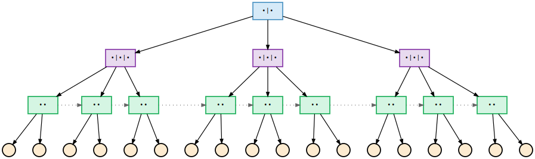

<div align="center">

<picture>
    
</picture>
<br>

<h2>Bptree</h2>

[](https://github.com/habedi/bptree/actions/workflows/tests.yml)
[](https://github.com/habedi/bptree/actions/workflows/lints.yml)
[](https://github.com/habedi/bptree/actions/workflows/benches.yml)
[](https://codecov.io/gh/habedi/bptree)
[](https://www.codefactor.io/repository/github/habedi/bptree)
[](https://github.com/habedi/bptree/blob/main/LICENSE)
[](https://github.com/habedi/bptree/releases/latest)

A B+ tree implementation in C

</div>

---

Bptree is a single-header, generic [B+ tree](https://en.wikipedia.org/wiki/B%2B_tree) implementation written in C.
It can be thought of an in-memory ordered map where keys are stored based on the ordering defined by some comparator function and
values can be any type of data.

### Features

- Single-header C library (see [bptree.h](include/bptree.h))
- Supports numeric and string keys as well as custom value types
- Supports insertion, deletion, as well as point and range queries
- Allows the user to manage memory for values
- Compatible with C11 or newer

---

### Getting Started

Download the [bptree.h](include/bptree.h) file and include it in your projects.

Define `BPTREE_IMPLEMENTATION` in one of your C source files before including the header:

```c
// Add these lines to one of your C source files (e.g., main.c)
#define BPTREE_IMPLEMENTATION
#include "bptree.h"
````

See the **Key and Value Configuration** section below for how to customize key and value types.

### Examples

| File                        | Description                        |
|:----------------------------|:-----------------------------------|
| [example.c](test/example.c) | Example usages of the B+ tree API. |

To compile and run the example(s), use the `make example` command.

### Documentation

API documentation can be generated using [Doxygen](https://www.doxygen.nl).
To generate the documentation, use the `make doc` command and then open the `doc/html/index.html` file in a web browser.

#### API Summary

| Function                    | Return Type     | Description                                                                                                                                                                          |
|:----------------------------|:----------------|:-------------------------------------------------------------------------------------------------------------------------------------------------------------------------------------|
| `bptree_create`             | `bptree *`      | Creates a new B+ tree with specified `max_keys`, comparator function (or `NULL` for default), and debug flag. Returns pointer to the tree or `NULL` on failure.                      |
| `bptree_free`               | `void`          | Frees the tree structure and all its internal nodes. It does not free memory for values stored in the tree.                                                                          |
| `bptree_put`                | `bptree_status` | Inserts a key-value pair. The key must not already exist in the tree.                                                                                                                |
| `bptree_get`                | `bptree_status` | Retrieves the value associated with a key via an out-parameter.                                                                                                                      |
| `bptree_contains`           | `bool`          | Checks if a key exists in the tree.                                                                                                                                                  |
| `bptree_remove`             | `bptree_status` | Deletes a key-value pair. Performs node rebalancing (key borrowing and node merging) if necessary.                                                                                   |
| `bptree_get_range`          | `bptree_status` | Gets values for keys within `[start, end]` (inclusive) via out-parameters for the results array and count. The caller must free the results array using `bptree_free_range_results`. |
| `bptree_free_range_results` | `void`          | Frees the array allocated by `bptree_get_range`.                                                                                                                                     |
| `bptree_get_stats`          | `bptree_stats`  | Returns tree statistics, including key count, height, and node count of the tree.                                                                                                    |
| `bptree_check_invariants`   | `bool`          | Checks structural correctness of the B+ tree (e.g., key ordering, node fill levels, and leaf depth).                                                                                 

| Type             | Description                                                                                |
|:-----------------|:-------------------------------------------------------------------------------------------|
| `bptree`         | The main B+ tree data structure.                                                           |
| `bptree_stats`   | The data type used for tree statistics (including key count, tree height, and node_count). |
| `bptree_key_t`   | The data type used for keys (configurable, defaults to `int64_t`).                         |
| `bptree_value_t` | The data type used for values (configurable, defaults to `void *`).                        |
| `bptree_status`  | Enum returned by most API functions showing success or failure (types) of operations.      |

> [!NOTE]
> The comparator function should have a signature similar `strcmp` where it returns a negative value if the first argument should
> come before the second (e.g., `a < b`), zero if they are equal, and a positive value if the first argument should come after the
> second (e.g., `a > b`).
> The B+ tree implementation relies on this specific behavior for correctly ordering keys in nodes and traversing the tree
> during search, insertion, and deletion operations.
> The default comparators provided in your code (`bptree_default_compare` for numeric types using `<` and `>`, and the one using
> `memcmp` for strings) adhere to this convention.

#### Status Codes

```c
// Status codes returned by bptree functions (defined in include/bptree.h)
typedef enum {
    BPTREE_OK = 0,             // Operation succeeded
    BPTREE_DUPLICATE_KEY,      // Key already exists during bptree_put
    BPTREE_KEY_NOT_FOUND,      // Key not found for get and remove operation
    BPTREE_ALLOCATION_FAILURE, // Memory allocation (e.g., malloc or aligned_alloc) failed
    BPTREE_INVALID_ARGUMENT,   // An invalid function argument provided
    BPTREE_INTERNAL_ERROR      // An unexpected internal state or error occurred
} bptree_status;
```

#### Key and Value Configuration

The key and value types, as well as linkage (static or dynamic), can be customized by defining these macros before including
`bptree.h` where
`BPTREE_IMPLEMENTATION` is defined:

| Macro                    | Description                                                                                                       | Default     |
|:-------------------------|:------------------------------------------------------------------------------------------------------------------|:------------|
| `BPTREE_NUMERIC_TYPE`    | Use a specific integer or floating-point type for keys (if `BPTREE_KEY_TYPE_STRING` is not defined).              | `int64_t`   |
| `BPTREE_KEY_TYPE_STRING` | Define this macro (no value needed) to use fixed-size string keys instead of numeric keys.                        | Not defined |
| `BPTREE_KEY_SIZE`        | Needed if `BPTREE_KEY_TYPE_STRING` is defined. Specifies the exact size (bytes) of the string key struct.         | Not defined |
| `BPTREE_VALUE_TYPE`      | Specifies the data type for values stored in the tree.                                                            | `void *`    |
| `BPTREE_STATIC`          | Define this macro (no value needed) along with `BPTREE_IMPLEMENTATION` to give the implementation static linkage. | Not defined |

| Type             | Description                                                                     | Default                                          |
|:-----------------|:--------------------------------------------------------------------------------|:-------------------------------------------------|
| `bptree_key_t`   | The C type representing a key. Resolved based on the `BPTREE_...` macros above. | `BPTREE_NUMERIC_TYPE` or `char[BPTREE_KEY_SIZE]` |
| `bptree_value_t` | The C type representing a value. Resolved from `BPTREE_VALUE_TYPE`.             | `void *`                                         |

> [!IMPORTANT]
> The tree only manages memory for its internal nodes. If the `bptree_value_t` items stored are pointers (e.g., `void *` or `struct
> my_data *`), the caller is responsible for managing the memory pointed to by these values (allocation and deallocation).
> Consequently, `bptree_free` only frees the tree's internal structure, not any external data referenced by the stored values.

##### Examples

To use `uint32_t` keys and `struct record *` values:

```c
#define BPTREE_NUMERIC_TYPE uint32_t
#define BPTREE_VALUE_TYPE struct record *
#define BPTREE_IMPLEMENTATION
#include "bptree.h"
```

To use fixed-size string keys (like 32-character strings) and store integer IDs as values:

```c
#define BPTREE_KEY_TYPE_STRING
#define BPTREE_KEY_SIZE 32
#define BPTREE_VALUE_TYPE intptr_t // Store integers directly if they fit
#define BPTREE_IMPLEMENTATION
#include "bptree.h"
```

### Tests and Benchmarks

| File                                  | Description                                                     |
|:--------------------------------------|:----------------------------------------------------------------|
| [test_bptree.c](test/test_bptree.c)   | Unit tests for the B+ tree API.                                 |
| [bench_bptree.c](test/bench_bptree.c) | Benchmarks for some of the operations supported by the B+ tree. |

To run the tests and benchmarks, use the `make test` and `make bench` commands.

-----

### Contributing

See [CONTRIBUTING.md](CONTRIBUTING.md) for details on how to make a contribution.

### License

Bptree is licensed under the MIT License ([LICENSE](LICENSE)).
